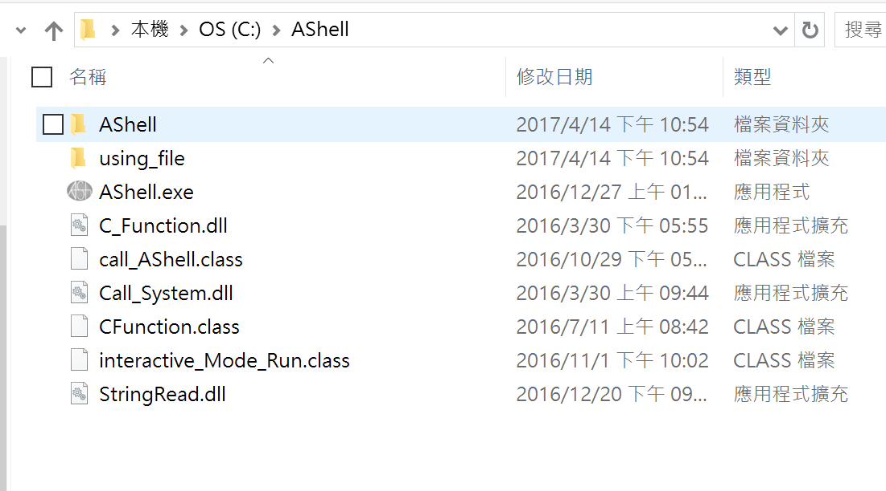
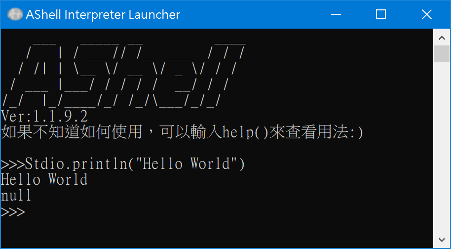

# AShell </img>
AShell腳本語言\
語法說明:
https://home.gamer.com.tw/creationDetail.php?sn=4387065 \
\
使用方法:\
下載[執行檔](https://github.com/jack850628/AShell/releases)並放到C:\裡 \

只需要在C:\AShell目錄下輸入AShell可以啟動AShell互動式命令列界面 \

使用方式： \
AShell [-e cmd | -f file | -v | -i | file ] [arg ...] \
-i             : 啟動交互式命令介面 \
-e com         : 由命令列讀取程式碼 \
-f file | file : 從檔案讀取程式碼 \
-v             : 版本資訊 
